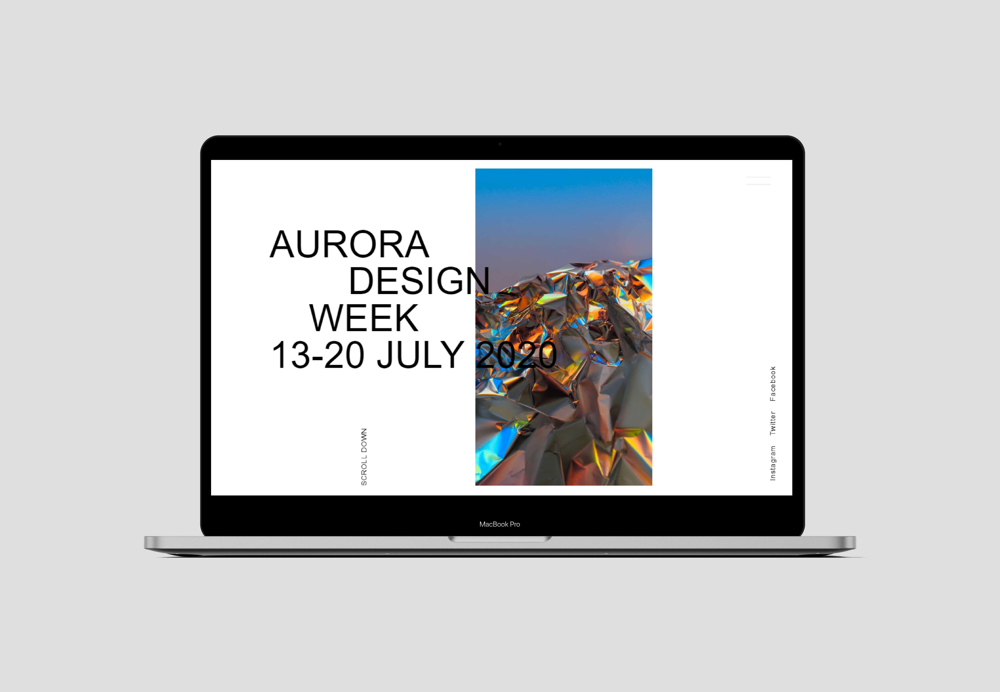

# Aurora Design Week

Aurora Design Week is a promoting event website, where user can find list of shows and speakers (including short descriptions). There is also a possibility to contact the organizers in "contact" tab.

Live: [link](https://aurora.jewulska.pl) 
(Recommended browsers: Opera & Chrome)

  

## Technology stack
- HTML5
- Bulma, SCSS
- Vue, Vuex, Vue Router

## Used templates
Idea and fragments of layout from [aurora free template](https://www.uistore.design/items/aurora-free-web-elements-for-adobe-xd-and-sketch/).

## Photos
All photos downloaded from [Unsplash](https://unsplash.com).
